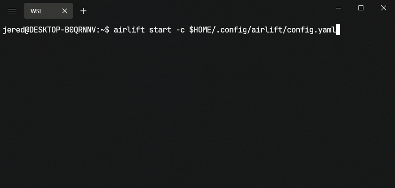

<h3 align="center">

</h3>
<h1 align="center">Airlift</h1>
<p align="center">
  <a href="https://pypi.org/project/airlift/">
    
  </a>
</p>

## Introduction

Airlift is a Command Line Interface (CLI) tool designed to provide a local development environment for Apache Airflow with a simple but flexible interface.
It is built on top of the official [Airflow Helm Chart](https://artifacthub.io/packages/helm/apache-airflow/airflow).
<h3 align="center">

</h3>

## Requirements

Airlift requires the following software to be installed on your system:

1. Helm
2. Docker
3. Kind

Below are the installation instructions for each of these tools on MacOS and Linux distributions.

It is also recommended to allocate at least 4GB of RAM for Docker to run this service.

### Install Homebrew

Homebrew is a package manager that we will use to install the necessary software. If you don't have Homebrew installed, you can install it by following these instructions:

```bash
/bin/bash -c "$(curl -fsSL https://raw.githubusercontent.com/Homebrew/install/HEAD/install.sh)"
```

### Install Software

With Homebrew installed, you can now install Helm, Docker, and Kind.

#### Helm

```bash
brew install helm
```

#### Docker

```bash
brew install --cask docker
```

-OR- use a tool like [Docker Desktop](https://www.docker.com/products/docker-desktop/) or [Rancher Desktop](https://rancherdesktop.io/)

#### Kind

```bash
brew install kind
```

## Installation

Airlift can be installed using pip:

```bash
pip install airlift
```

## Usage

The general syntax for using the Airlift CLI tool is:

```bash
airlift [subcommand] [options]
```

### Subcommands and Options

#### 1. start

Starts the Airflow service.

```bash
airlift start -d /path/to/dags -p /path/to/plugins -r /path/to/requirements.txt
```

**Note: The DAG and Plugins folders are mounted directly to the airflow service for hot-reloading. When you make a change locally, it should automatically appear in the Airflow UI.**

**Note: Start times for Airflow can be upwards of 5 minutes, due to the bootstrapping, installation of required PyPi packages, and the creation of the Postgres database.
This all depends on your local machines power & the complexity of your Airflow setup.**

#### 2. check

Checks if all pre-requisite software is installed.

```bash
airlift check
```

#### 3. pause

Pauses the Airflow service.

```bash
airlift pause
```

#### 4. unpause

Unpauses the Airflow service.

```bash
airlift unpause
```

#### 5. remove

Removes all containers/clusters related to the `airlift` service.

```bash
airlift remove
```

#### 6. status

Checks the status of the service and whether or not it is reachable.

```bash
airlift status -P 8080
```

#### 7. import_variables

Imports a `variables.json` file to a running Airflow instance.

```bash
airlift import_variables -P 8080 -V /path/to/variables.json
```

#### 8. run_dag

Runs a DAG given an ID.

```bash
airlift run_dag -P 8080 -D example_dag_id
```

### Configuration files

#### Helm values.yaml

This file provides the configuration for the Airflow Helm chart. This can be used for things such as:

1. Setting the Secrets Backend to AWS Secrets Manager
2. Adding custom environment variables (such as connections)
3. Changing the executor
4. Modifying the memory allocation for the webserver/scheduler/workers
5. Updating any `airflow.cfg` value.

Here's an example:

```yaml
executor: "CeleryExecutor"
config:
  core:
    load_examples: 'False'
    executor: CeleryExecutor 
    colored_console_log: 'False'
# Airflow scheduler settings
scheduler:
  #  hostAliases for the scheduler pod
  hostAliases: []
  #  - ip: "127.0.0.1"
  #    hostnames:
  #      - "foo.local"
  #  - ip: "10.1.2.3"
  #    hostnames:
  #      - "foo.remote"

  # If the scheduler stops heartbeating for 5 minutes (5*60s) kill the
  # scheduler and let Kubernetes restart it
  livenessProbe:
    initialDelaySeconds: 10
    timeoutSeconds: 20
    failureThreshold: 5
    periodSeconds: 60
    command: ~
  # Airflow 2.0 allows users to run multiple schedulers,
  # However this feature is only recommended for MySQL 8+ and Postgres
  replicas: 1
  # Max number of old replicasets to retain
  revisionHistoryLimit: ~

  # Command to use when running the Airflow scheduler (templated).
  command: ~
  # Args to use when running the Airflow scheduler (templated).
  args: ["bash", "-c", "exec airflow scheduler"]
```

You can find all the possible configuration overrides here: <https://artifacthub.io/packages/helm/apache-airflow/airflow?modal=values>

#### Airlift Configuration

The Airlift configuration file overrides all flag values to simplify starting the service.

For example, `$HOME/.config/airlift/config.yaml`:

```yaml
# config.yaml
dag_path: /path/to/dags
plugin_path: /path/to/plugins
requirements_file: /path/to/requirements.txt
helm_values_file: /path/to/values.yaml
airlift_config_file: /path/to/airlift/config.yaml
extra_volume_mounts:
  - hostPath=/my/cool/path,containerPath=/my/mounted/path,name=a_unique_name
cluster_config_file: /path/to/cluster/config.yaml
image: 'apache/airflow:2.6.0'
helm_chart_version: '1.0.0'
port: 8080
post_start_dag_id: 'example_dag_id'
```

In this example, `dag_path` in the yaml file overrides the `-d` setting, `plugin_path` overrides the `-p` setting, and so forth.

Using this configuration, you can now start the service using:

```bash
airlift start -c $HOME/.config/airlift/config.yaml
```

## Examples

[See here for examples with common configuration modifications.](./docs/examples/)

## FAQ

[See here for Frequently Asked Questions](./docs/faq.md)

## Motivation

The motivation behind the creation of Airlift is to simplify the process of setting up a local development environment for Apache Airflow. It aims to be a flexible tool that allows developers to easily configure and manage their Airflow instances with unlimited flexibility.

## Support and Contribution

If you encounter any issues or have suggestions for improvements, feel free to open an issue on the GitHub repository. Contributions to the project are also welcome.

## Contact

If you have questions or feedback about Airlift, please reach out by opening an issue on the GitHub repository.
